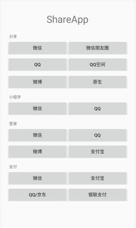

# Social  版本 1.3

#### Documentation

微信 微博 支付宝 QQ 【 登陆 、分享、支付 原生分享】 。独立library 调用方便 详看文档



本Library各包均单独使用其中common库必须依赖，截止2024-01-20，

微博使用最新。 支付宝最新。 QQ最新。 微信是最新

<B>主要提供服务：</B><br>
支付：
微信支付，支付宝支付，银联/qq暂未接入<br>
登录：
支付宝授权，微信授权，qq授权，微博授权<br>
分享：
qq分享，qq空间分享，微博分享，微信分享，微信收藏，微信朋友圈分享 系统原生分享
<br><br><br>

<B>集成方法：</B>

```
//添加如下仓库
allprojects {
        maven { url "https://jitpack.io" }
}
```

//公共库必须依赖

```
//无论使用本库任一library都必须依赖此library
//此库未依赖任何第三方，仅支持系统分享、支付宝个人首款码支付，跳转微信扫一扫页面 
    implementation 'com.gitee.mahongyin.social:common:1.3.1'
```

//以下按需依赖

```
//支付宝  
    implementation 'com.gitee.mahongyin.social:ali:1.3.1'
//QQ
   implementation 'com.gitee.mahongyin.social:qq:1.3.1'
//微信
    implementation 'com.gitee.mahongyin.social:wx:1.3.1'
//微博   不支持x86
  implementation 'com.gitee.mahongyin.social:wb:1.3.1'
```

//////////////////////////////////////////////////////////////////////////////////////
**AndroidManifest.xml配置**

```
<!-- 微信分享 -->
<activity
    android:name=".wxapi.WXEntryActivity"
    android:exported="true"/>
<!-- 微信支付 -->
<activity
    android:name=".wxapi.WXPayEntryActivity"
    android:exported="true"/>
    
 <!-- qq登陆认证 -->
 <activity
     android:name="com.tencent.tauth.AuthActivity"
     android:launchMode="singleTask"
     android:exported="true"
     android:noHistory="true">
     <intent-filter>
         <action android:name="android.intent.action.VIEW" />
         <category android:name="android.intent.category.DEFAULT" />
         <category android:name="android.intent.category.BROWSABLE" />
         <data android:scheme="tencent换成你的appid" />
     </intent-filter>
 </activity> 
```

**Application配置**

```
//集成微信
在你包名下 新建wxapi包里面新建类 分享登陆WXEntryActivity  支付WXPayEntryActivity
两个类按需新建 都建无妨  只需按如下继承即可,不需要其他代码
public class WXEntryActivity extends BaseWXActivity {}
public class WXPayEntryActivity extends BaseWXPayEntryActivity {} 
```

```
在你的Application里 onCreate()里  【记得别忘AndroidManifest.xml里添加】
WxSocial.setWeixinId("你的微信appid");
QqSocial.setAppId("你的QQ appid");
WbSocial.setWbApp("2045436852",//你的微博Key
                "http://www.sina.com",//你对应的授权回调
                "email,direct_messages_read,direct_messages_write,"+ "friendships_groups_read,friendships_groups_write,statuses_to_me_read,"
                + "follow_app_official_microblog," + "invitation_write");
                //第三个参数是在微博开放平台为应用申请的高级权限
                
支付宝从后端返回拼接字符串》调用的时候传入
```

**App配置**

```
**先说接收回调数据*******************************
因微博和QQ需要onActivityresult（）返回数据 因此他俩登陆 均使用 AuthApi和ShareApi获取实例后在你当前Activity/ Fragment 中
protected void onActivityResult(int requestCode, int resultCode, @Nullable Intent data) {
        //微博和QQ需要
        if (api != null) {
            api.onActivityResult(requestCode, resultCode, data);
            api = null;
        }
        if (spi != null) {
            spi.onActivityResult(requestCode, resultCode, data);
            spi = null;
        }
        super.onActivityResult(requestCode, resultCode, data);
    }
    
// 回调 ****************************** 
**所有回调都从以下3个接口对应出来 只需实现方法即可** 
  //登陆回调
    private AuthApi.OnAuthListener onAuthListener = new AuthApi.OnAuthListener() {
        @Override
        public void onComplete(int type, Object user) {
            //这里根据type使用不同对象 
           switch (type){
                case SocialType.ALIPAY_Auth:
//                    ali AuthResult
                    break;
                case SocialType.QQ_Auth:
//                    JSONObject data = (JSONObject) user;
//                    String openID = data.getString("openid");
//                    String accessToken = data.getString("access_token");
//                    String expires = data.getString("expires_in");
                    break;
                case SocialType.WEIBO_Auth:
//                    wb（Oauth2AccessToken）user 
                break;
                case SocialType.WEIXIN_Auth:
//                    wx((WeiXin)user).getCode()
                    break;
                ...
            }
            Toast.makeText(MainActivity.this, "登录成功", Toast.LENGTH_SHORT).show();
        }

        @Override
        public void onError(int type, String error) {
            Toast.makeText(MainActivity.this, "登录失败:" + error, Toast.LENGTH_SHORT).show();
        }

        @Override
        public void onCancel(int type) {
            Toast.makeText(MainActivity.this, "登录取消", Toast.LENGTH_SHORT).show();
        }
    };

    //支付回调
    private PayApi.OnPayListener onPayListener = new PayApi.OnPayListener() {
        @Override
        public void onPayOk() {
            Toast.makeText(MainActivity.this, "支付成功", Toast.LENGTH_SHORT).show();
        }

        @Override
        public void onPayFail(String code, String msg) {
            Toast.makeText(MainActivity.this, "支付失败：" + msg, Toast.LENGTH_SHORT).show();
        }
    };
    
    //分享回调
    private ShareApi.OnShareListener onShareListener = new ShareApi.OnShareListener() {
        @Override
        public void onShareOk(int type) {
            Toast.makeText(MainActivity.this, "分享成功", Toast.LENGTH_SHORT).show();
        }

        @Override
        public void onShareFail(int type, String msg) {
            Toast.makeText(MainActivity.this, "分享失败:" + msg, Toast.LENGTH_SHORT).show();
        }
    };

 **再说使用*******************************  
 //原生分享
        findViewById(R.id.btn_share_local).setOnClickListener(new View.OnClickListener() {
            @Override
            public void onClick(View v) {
                v.startAnimation(shake);
                ShareUtil shareUtil = ShareUtil.getInstance(MainActivity.this);
//                shareUtil.shareImg(R.mipmap.ic_launcher, ShareUtil.package_ali);
//                shareUtil.shareText("【flutter凉了吗?】知乎：… https://www.zhihu.com/question/374113031/answer/1253795562?utm_source=com.eg.android.alipaygphone&utm_medium=social&utm_oi=1020568397012209664 （分享自知乎网）");
                shareUtil.shareImg(getExternalFilesDir(null) +"/hhhh.jpg", ShareUtil.package_ali);
//                shareUtil.shareImg(getExternalFilesDir(null) +"/hhhh.jpg", "com.sina.weibo", "com.sina.weibo.EditActivity");
//                shareUtil.shareImg(getExternalFilesDir(null) +"/hhhh.jpg", "com.qzone", "com.qzonex.module.operation.ui.QZonePublishMoodActivity");
//                shareUtil.shareImg(getExternalFilesDir(null) +"/hhhh.jpg", "com.tencent.mobileqq", "com.tencent.mobileqq.activity.JumpActivity");
//                shareUtil.shareImg(getExternalFilesDir(null) +"/hhhh.jpg", "com.tencent.mm", "com.tencent.mm.ui.tools.ShareToTimeLineUI");
//                shareUtil.shareImg(getExternalFilesDir(null) + "/hhhh.jpg", "com.tencent.mm", "com.tencent.mm.ui.tools.ShareImgUI");
            }
        });
 
        //微信分享
        findViewById(R.id.btn_share_wx).setOnClickListener(new View.OnClickListener() {
            @Override
            public void onClick(View v) {
                WxShare mShareApi = new WxShare(MainActivity.this, ShareEntity.TYPE_WX, onShareListener);
                mShareApi.doShare(createWXShareEntity(false));
                v.startAnimation(shake);
            }
        });
        //微信朋友圈分享
        findViewById(R.id.btn_share_wx_circle).setOnClickListener(new View.OnClickListener() {
            @Override
            public void onClick(View v) {
                WxShare mShareApi = new WxShare(MainActivity.this, ShareEntity.TYPE_PYQ, onShareListener);
                mShareApi.doShare(createWXShareEntity(true));
                v.startAnimation(shake);
            }
        });
        //微信登录
        findViewById(R.id.btn_login_wx).setOnClickListener(new View.OnClickListener() {
            @Override
            public void onClick(View v) {
//                WxAuth wxAuth=new WxAuth(MainActivity.this, onAuthListener);
//                wxAuth.doAuth();
                WxAuth authApi = new WxAuth(MainActivity.this, onAuthListener);
                authApi.doAuth();
                v.startAnimation(shake);

            }
        });
        //qq登录
        findViewById(R.id.btn_login_qq).setOnClickListener(new View.OnClickListener() {
            @Override
            public void onClick(View v) {
                QqAuth authApi = new QqAuth(MainActivity.this, onAuthListener);
                authApi.doAuth(false);
                v.startAnimation(shake);
                api = authApi;//onActivityResult()内使用
            }
        });
  
        //打开qq小程序
        findViewById(R.id.btn_mini_qq).setOnClickListener(new View.OnClickListener() {
            @Override
            public void onClick(View v) {
                v.startAnimation(shake);
                QqAuth authApi = new QqAuth(MainActivity.this, onAuthListener);
                authApi.doOpenMiniApp("1108108864", "pages/tabBar/index/index", "release");
            }
        });
        //qq分享
        findViewById(R.id.btn_share_qq).setOnClickListener(new View.OnClickListener() {
            @Override
            public void onClick(View v) {
                QqShare mShareApi = new QqShare(MainActivity.this, SocialType.QQ_Share, onShareListener);
                mShareApi.doShare(QQShareEntity.createImage(getExternalFilesDir(null) + "/aaa.png", "app"));
                spi = mShareApi;
                v.startAnimation(shake);
            }
        });
        //qq空间分享
        findViewById(R.id.btn_share_qq_zone).setOnClickListener(new View.OnClickListener() {
            @Override
            public void onClick(View v) {
                ArrayList<String> imgUrls = new ArrayList<>();
                imgUrls.add(getExternalFilesDir(null) + "/aaa.png");
                imgUrls.add(getExternalFilesDir(null) + "/bbb.jpg");
                QqShare mShareApi = new QqShare(MainActivity.this, SocialType.QQ_ZONE_Share, onShareListener);
                mShareApi.doShare(QQShareEntity.createImageTextToQZone("toptitle", "http://www.baidu.com", imgUrls, "summary", "我"));
                spi = mShareApi;
                v.startAnimation(shake);
            }
        });
        //qq空间说说
        findViewById(R.id.btn_share_qq_zone).setOnLongClickListener(new View.OnLongClickListener() {            @Override
            public boolean onLongClick(View v) {
                ArrayList<String> imgUrls = new ArrayList<>();
                imgUrls.add(getExternalFilesDir(null) + "/aaa.png");
                imgUrls.add(getExternalFilesDir(null) + "/bbb.jpg");
                mShareApi = new QqShare(MainActivity.this, onShareListener);
                mShareApi.doShare(QQShareEntity.createPublishTextToQZone("发个说说"));
                //spi = mShareApi;
                v.startAnimation(shake);
            return true;
        }
        });
        //支付宝登陆
        findViewById(R.id.btn_login_ali).setOnClickListener(new View.OnClickListener() {
            @Override
            public void onClick(View v) {
                AliAuth authApi = new AliAuth(MainActivity.this, onAuthListener);
                authApi.doAuth("找后台要拼接字符串，格式看阿里文档");
                v.startAnimation(shake);
            }
        });
        //支付宝支付
        findViewById(R.id.btn_pay_alipay).setOnClickListener(new View.OnClickListener() {
            @Override
            public void onClick(View v) {
                AliPay authApi = new AliPay(MainActivity.this, onPayListener);
                authApi.doPay(new AliPayContent("找后台要拼接字符串，格式看阿里文档"));
                v.startAnimation(shake);
            }
        });
        //微信支付
        findViewById(R.id.btn_pay_wx).setOnClickListener(new View.OnClickListener() {
            @Override
            public void onClick(View v) {
                try {
                    JSONObject jsonObject = new JSONObject("source json data...");
                    //服务端获取
                    jsonObject = jsonObject.getJSONObject("pay_message");

                    WxPayContent req = new WxPayContent(
                            jsonObject.getString("appid"),
                            jsonObject.getString("partnerid"),
                            jsonObject.getString("prepayid"),
                            jsonObject.getString("packagestr"),
                            jsonObject.getString("noncestr"),
                            jsonObject.getString("timestamp"),
                            jsonObject.getString("sign"));
                    PayApi wxApi = new WxPay(MainActivity.this, onPayListener);
                    wxApi.doPay(req);
                    v.startAnimation(shake);
                } catch (JSONException ignored) {

                }
            }
        });
        //小程序分享
        findViewById(R.id.btn_mini_wx).setOnClickListener(new View.OnClickListener() {
            @Override
            public void onClick(View v) {
                v.startAnimation(shake);
//            WxShare wxShare=new WxShare(MainActivity.this,SocialType.WEIXIN_Share,onShareListener);
//            wxShare.doShare(WxShareEntity.createMiniApp( miniAppid, miniPath, webpageUrl, title, desc, imgUrl));

                WxAuth wxAuth = new WxAuth(MainActivity.this, onAuthListener);
                wxAuth.doOpenMiniApp("gh_d43f693ca31f", "", WXLaunchMiniProgram.Req.MINIPTOGRAM_TYPE_RELEASE);
            }
        });
        //微博分享
        findViewById(R.id.btn_share_weibo).setOnClickListener(new View.OnClickListener() {
            @Override
            public void onClick(View v) {
                WbShare wbShare = new WbShare(MainActivity.this, SocialType.WEIBO_Share, onShareListener);
                wbShare.doShareStory(WbShareEntity.createImageStory(getExternalFilesDir(null) + "/aaa.png"));
                spi = wbShare;
                v.startAnimation(shake);
            }
        });
        //微博登录
        findViewById(R.id.btn_login_weibo).setOnClickListener(new View.OnClickListener() {
            @Override
            public void onClick(View v) {
                WbAuth wbAuth = new WbAuth(MainActivity.this, onAuthListener);
                wbAuth.doAuth();
                api = wbAuth;
                v.startAnimation(shake);
            }
        });
```

```text
 关于分享 使用对应ShareEntity  的createXXX 方法传参调用对应分享的包装内容 参考demo
```